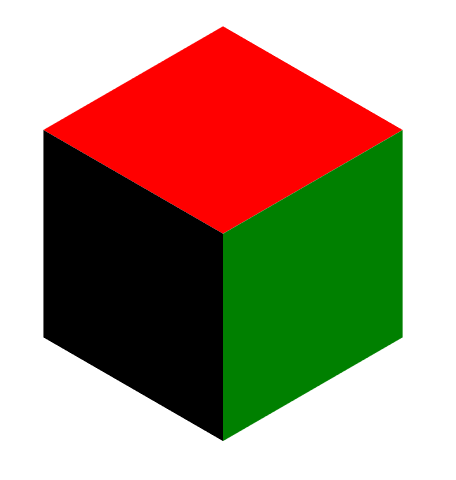

# iso-svg

Isometric projection rendered in SVG



## How to build

```
stack setup
stack build
```

* To build the examples, `stack build --flag iso-svg:examples`

## TO DO

* Use normal to determine shading
* Render using a camera
* Fix rotation in `isometricProject`

## DONE

* ~~Scene graph, camera, etc.~~
* ~~Evaluate scene graph~~ 

## License

BSD3

## Contributions

Bug reports, pull requests, feature requests are welcome